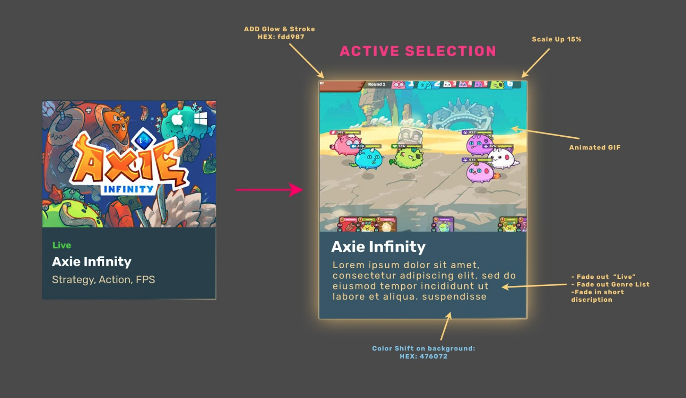

## Earn Alliance: Game Directory
 
### Welcome to the Earn Alliance Game Directory Test!
If you're here, then you've passed the initial interview stage. Welcome and we're excited to see what you can build!! Please find all the information in the proceeding sections to help you get started.

### Your Challenge
We would like you to implement UX functionality and feedback effects for the Game Directory page as displayed in the Figma link below. You will utilise the backend provided in Docker as your source of data.

### Figma Layout
[Figma Design Layout link](https://www.figma.com/file/UTCMLQ8zlO3w5KoKgUJcmf/Game-Directory?node-id=0%3A1)

### Required Functionality
The user should be able to organise the directory content by:
* Searching for games by name 
* Filter by selecting a category from a dropdown
* Toggling live/non-live games

When the user hovers over a game module in the directory it should:
* Smoothly scale up module slightly with an ease-in / ease-out transition effect
* At the same time as the scale up - fade in a light glow behind the selected module and add stroke around it
* At the same time as the scale-up - fade out the “live” and genre. Move the game title up.
* At the same time as the scale-up - reveal a short 1 line description below the title.
* At the same time as the scale-up - play animated gif in the area where the key art normally resides.

(See below image for reference)



## Environment Setup

We have provided a `docker-compose` file to help you setup your backend for this task. The docker-compose file will spin up a Postgres container and a Hasura graphql engine container. For background info on Hasura, see [here](https://hasura.io/).

Before starting, please ensure you have [docker-compose](https://docs.docker.com/compose/) and [Docker](https://www.docker.com/) installed on your system.

Run your environment with `docker-compose up -d`.

To check the status of the containers, run `docker-compose ps`.

To check the logs of the containers, run `docker-compose logs -f`.

You can browse the Hasura interface at `http://localhost:8080`. You will need the `admin` password to access the admin interface. The password can be found in the `docker-compose.yml` file under `HASURA_GRAPHQL_ADMIN_SECRET`

To run a simple query in the GraphQL console, you can navigate the GraphiQL panel in the console. At the top of the console under **GraphQL Endpoint** you will see the endpoint for both http and websocket queries for your frontend to use.

To list all games in the postgres database, you can run :
```
query MyQuery {
  games {
    name
  }
}
```
This will return a list something like so :

```
{
  "data": {
    "games": [
      {
        "name": "Stella Fantasy"
      },
      {
        "name": "Phantom Galaxies"
      },
```
Another sample query to return a specific game genre :
```
query MyQuery {
  game_genre_types(where: {genre_name: {_eq: "FPS"}}) {
    genre_name
  }
}
```
This will return only the game genre for First Person Shooter (FPS).

To stop the containers, run `docker-compose down`.

### Resources 
* Images and gifs can be found in the `public/images` folder.
* `docker-compose` file for standing up your backend environment.
* We've already created a bootstrapped react app for you

## Notes

1. You have 4 days to complete this task. We estimate it will take approximately 4 hours to complete. If you are unable to complete the task in this time, please submit what you have completed and we will review it.
2. Please use PR's to submit your work and add comments to help us understand your approach.
3. Please use the `develop` branch to submit your work.
4. You will receive an invite to a Slack Channel where you will be able to ask questions and get feedback from the Earn Alliance team.
5. What if I find this task easy, can I add my own style to it? Of course, while we're testing you on execution, feel free to add your own style and flair to the task.
6. Please complete the submission as if it would be your best work getting ready to be shipped into production.
7. Good luck and have fun!